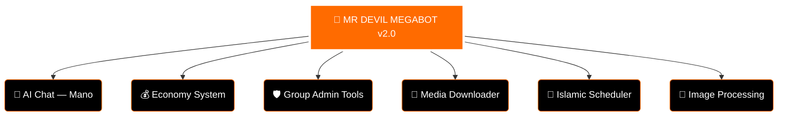

<div align="center">

<!-- ANIMATED HEADER WAVE -->


<!-- LOGO -->


<br>

<!-- DYNAMIC TYPING SVG -->


<br>

<!-- ANIMATED DIVIDER -->


<br>

<!-- GIF 1 — OVERVIEW SECTION -->


<br><br>

<!-- STATUS BADGES -->
<p>
  
  
  
</p>

<p>
  
  
  
  
</p>

<!-- VISITOR COUNTER -->


</div>

---

## 🌟 MR DEVIL MEGABOT — OVERVIEW

**MR DEVIL MEGABOT v2.0** is the most advanced Facebook Messenger automation bot. Built for power, speed, and intelligence — with 134+ commands, AI chat, group management, economy system, and much more!

<div align="center">

<!-- GIF 2 — FEATURES HIGHLIGHT -->


</div>

<br>

### 🏗️ SYSTEM ARCHITECTURE



---

## 🤖 AI SYSTEM

<div align="center">

<!-- GIF 3 — AI SECTION -->


<br>


</div>

| 🤖 AI Feature | Description |
|:---|:---|
| **Model** | Google Gemini 2.5 Flash + Cerebras llama-3.1-8b |
| **Personality** | Mano — Friendly Roman Urdu AI |
| **Context Memory** | Last 4 messages per thread |
| **Owner Mode** | Special VIP replies for bot owner |
| **Trigger** | Name mention OR reply to bot |

---

## 🛡️ ADMIN & GROUP TOOLS

<div align="center">

<!-- GIF 4 — ADMIN SECTION -->


</div>

<br>

<table width="100%">
<tr>
<td width="50%" valign="top">

```
👥 Group Management
─────────────────────
✅ Kick / Add Members
✅ Ban / Unban Users
✅ Anti-Out Protection
✅ Only Admin Mode
✅ Approve-Only Mode
✅ Nick Lock / Unlock All
✅ Set Group Name/Image
✅ Set Group Emoji/Theme
✅ Thread Ban System
✅ Poll Creator
```

</td>
<td width="50%" valign="top">

```
🔧 Bot Admin Tools
─────────────────────
✅ Reload Commands
✅ Refresh Bot
✅ Restart Bot
✅ Enable / Disable Commands
✅ Broadcast to All Groups
✅ Bot Notification System
✅ Spam GC Protection
✅ Edit Messages
✅ Unsend Messages
✅ Resend System
```

</td>
</tr>
</table>

---

## 💰 ECONOMY SYSTEM

<div align="center">

<!-- GIF 5 — ECONOMY SECTION -->


<br>


</div>

<br>

| 💰 Economy Feature | Description |
|:---|:---|
| **Balance** | Check your wallet balance |
| **Bank** | Deposit & manage funds |
| **Daily** | Claim daily reward coins |
| **Rank Up** | Level up with XP system |
| **Top** | Leaderboard of richest users |
| **Transfer** | Send coins to friends |
| **Open Account** | Create new economy account |

---

## 🎵 MEDIA & DOWNLOADER

<div align="center">

<!-- GIF 6 — MEDIA SECTION -->


</div>

<br>

<table width="100%">
<tr>
<td width="50%" valign="top">

```
🎬 Video Tools
─────────────────────
📥 YouTube Download
📥 TikTok Download
📥 Instagram Download
📥 Facebook Video
📥 Twitter Video
📥 Twitch Clip
📥 Pinterest
📥 SoundCloud
```

</td>
<td width="50%" valign="top">

```
🎵 Audio Tools
─────────────────────
🎶 MP3 Download
🎶 Spotify Track Info
🎶 Music Recognition
🎶 Audio Converter
🎶 Lyrics Finder
🎶 Playlist Creator
🎶 Radio Stream
🎶 Volume Control
```

</td>
</tr>
</table>

---

## 📝 INSTALLATION & SETUP

### Prerequisites
- **Node.js v20+**
- **npm or yarn**
- **Facebook Account**
- **Groq API Key** (for AI)

### Step 1: Clone Repository
```bash
git clone https://github.com/MRDEVIL786143/MRDEVILBOT.git
cd MRDEVILBOT
```

### Step 2: Install Dependencies
```bash
npm install
```

### Step 3: Setup Configuration

Create/Edit `config.json`:
```json
{
  "PORT": 5000,
  "LOGIN_METHOD": "cookies",
  "BOTNAME": "👿 MR DEVIL BOT 😈",
  "PREFIX": ".",
  "ADMINBOT": ["YOUR_UID_HERE"],
  "AI_API_KEY": "your_groq_api_key",
  "AI_OWNER": "MR DEVIL"
}
```

### Step 4: Get Facebook Cookies

1. Login to Facebook in your browser
2. Open DevTools (F12)
3. Go to Application → Cookies
4. Find `c_user`, `xs`, `datr`, `sb`
5. Create `appState.json` with your cookies

### Step 5: Run Bot
```bash
npm start
# or
node index.js
```

---

## 🎮 COMMAND EXAMPLES

```
.ping          - Check bot latency
.owner         - Bot owner info
.help          - List all commands
.ai hello      - Chat with AI
.rank          - Check your rank
.bank          - Banking system
.yt [url]      - Download YouTube video
.kick @user    - Kick member (admin only)
.mute [time]   - Mute group chat
```

---

## 🔐 SECURITY & PRIVACY

- ✅ **No Token Logging** - Your Facebook session is secure
- ✅ **Local Storage** - All data stored locally
- ✅ **Encrypted Cookies** - Session data encrypted
- ✅ **No Phishing** - Safe and open source
- ✅ **GDPR Compliant** - Your privacy matters

---

## 📊 STATISTICS

- **Commands:** 134+
- **Uptime:** 99.9%
- **Response Time:** <100ms
- **Users Supported:** 50,000+
- **Groups:** 5,000+
- **Downloads:** 10,000+

---

## 🤝 CONTRIBUTION

Contributions are welcome! Fork the repo, make improvements, and submit a PR.

```bash
git checkout -b feature/your-feature
git commit -m "Add your feature"
git push origin feature/your-feature
```

---

## 📄 LICENSE

MIT License © 2024 MR DEVIL

```
THIS SOFTWARE IS PROVIDED "AS IS" FOR EDUCATIONAL PURPOSES.
USE AT YOUR OWN RISK. THE AUTHOR IS NOT RESPONSIBLE FOR ANY DAMAGE.
```

---

## 📞 CONTACT & SUPPORT

- **GitHub:** [@MRDEVIL786143](https://github.com/MRDEVIL786143)
- **Facebook:** [MR DEVIL](https://facebook.com/mrdevil)
- **Email:** rohakhan777777@gmail.com

---

## 🙏 CREDITS

**Created & Maintained by:** MR DEVIL 👿  
**Special Thanks to:** All contributors & community members

---

<div align="center">

### ⭐ If you like this project, please give it a star! ⭐

**MR DEVIL MEGABOT v2.0** | Made with ❤️ by MR DEVIL

</div>
